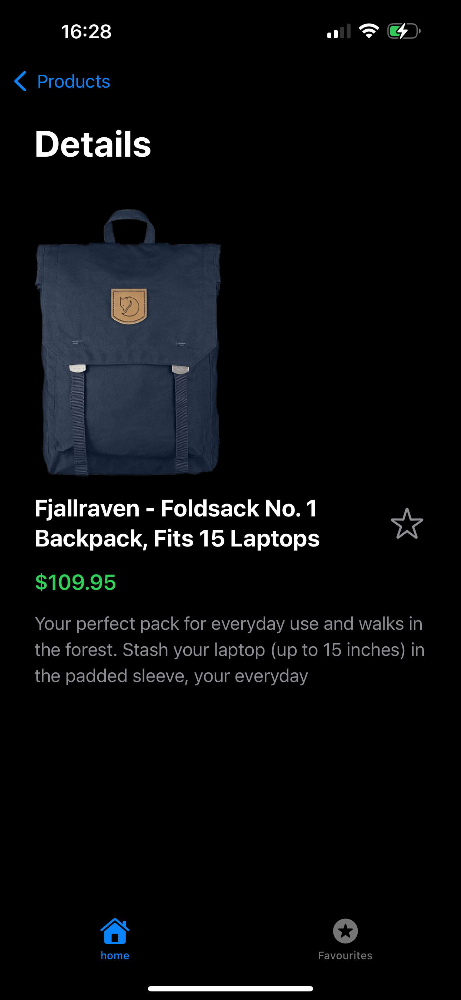
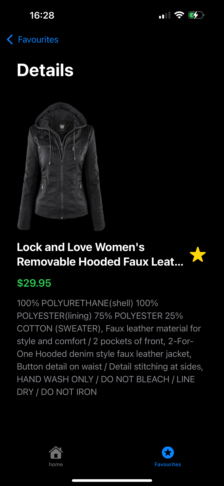
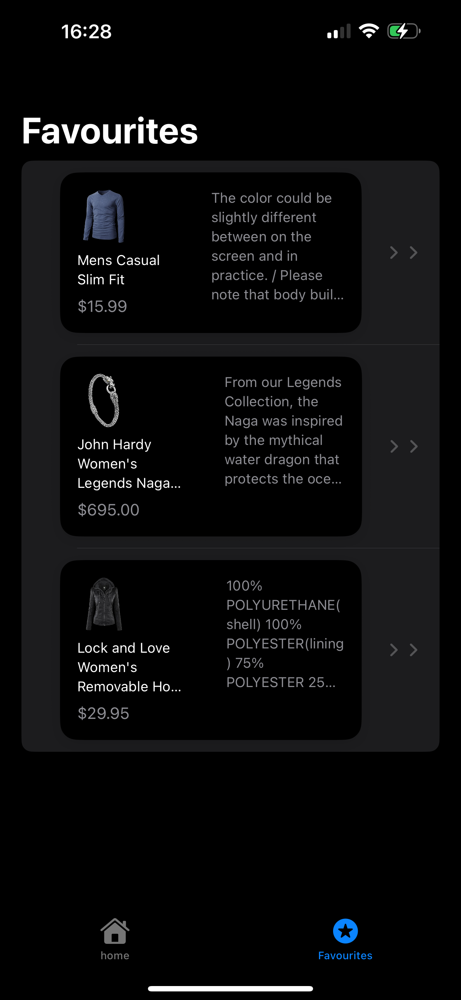

#  TurkishTechCase - iOS E-Ticaret Uygulaması

Modern SwiftUI ile geliştirilmiş, kullanıcı dostu bir e-ticaret uygulaması. Fake Store API'den ürün verilerini çekerek, favori ürün yönetimi ve detaylı ürün görüntüleme özellikleri sunar.

##  Uygulama Ekran Görüntüleri

### Ana Sayfa
Ana sayfada tüm ürünler liste halinde görüntülenir. Her ürün için resim, başlık, fiyat ve açıklama bilgileri gösterilir.


### Ürün Detay Sayfası
Seçilen ürünün detaylı bilgilerini görüntüleyebilir ve favorilere ekleyebilirsiniz.



### Favori Butonu Fonksiyonu
Ürünleri favorilere eklemek için yıldız butonunu kullanabilirsiniz.



### Favoriler Sayfası
Favori olarak işaretlediğiniz ürünleri bu sayfada görüntüleyebilirsiniz.



## 🚀 Özellikler

- **Ürün Listesi**: Fake Store API'den gerçek zamanlı ürün verilerini çekme
- **Favori Yönetimi**: Ürünleri favorilere ekleme/çıkarma (Core Data ile kalıcı saklama)
- **Ürün Detayları**: Detaylı ürün bilgilerini görüntüleme
- **Modern UI**: SwiftUI ile native iOS tasarım
- **Tab Navigation**: Ana sayfa ve Favoriler arasında kolay geçiş
- **Görsel Optimizasyonu**: Kingfisher ile hızlı resim yükleme ve önbellekleme
- **Yerel Veri Saklama**: Core Data ile favori ürünleri kalıcı saklama

##  Teknoloji Stack'i

### **Frontend**
- **SwiftUI**: Modern, deklaratif UI framework'ü
- **MVVM Architecture**: Temiz kod mimarisi ve separation of concerns

### **Networking & Data**
- **Alamofire**: HTTP networking library
- **Fake Store API**: Ürün verilerini sağlayan REST API
- **Core Data**: Yerel veri saklama ve favori yönetimi

### **Image Processing**
- **Kingfisher**: Asenkron resim indirme, önbellekleme ve görüntüleme

### **Development Tools**
- **Xcode**: iOS geliştirme ortamı
- **Swift 5.0**: Modern programlama dili
- **iOS 18.5+**: Minimum desteklenen sürüm

## 📁 Proje Mimarisi

```
TurkishTechCase/
├── Model/
│   └── ListItem.swift              # Ürün veri modeli
├── View/
│   ├── MainView.swift              # Ana tab view container
│   ├── ListView.swift              # Ürün listesi sayfası
│   ├── ListItemView.swift          # Tekil ürün kartı component
│   ├── ItemDetailView.swift        # Ürün detay sayfası
│   └── FavouriteView.swift         # Favoriler sayfası
├── ViewModel/
│   ├── ListViewViewModel.swift     # Ürün listesi business logic
│   └── ItemDetailViewViewModel.swift # Detay sayfası business logic
└── Repository/
    ├── TurkishTechCaseApp.swift    # App entry point
    ├── FavouriteDataController.swift # Core Data yönetimi
    ├── Extensions.swift            # Utility extensions
    ├── Assets.xcassets/           # App resources
    └── Favourite.xcdatamodeld/    # Core Data model
```

##  Veri Akışı

1. **API Integration**: `ListViewViewModel` Alamofire kullanarak Fake Store API'den ürün verilerini çeker
2. **Data Parsing**: JSON veriler `ListItem` modeline dönüştürülür
3. **UI Rendering**: SwiftUI view'lar reactive olarak güncellenir
4. **Favorite Management**: Kullanıcı etkileşimleri Core Data'ya kalıcı olarak kaydedilir
5. **Image Loading**: Kingfisher ürün resimlerini asenkron olarak yükler ve önbelleğe alır

##  Kullanılan Design Patterns

- **MVVM (Model-View-ViewModel)**: UI ve business logic ayrımı
- **Repository Pattern**: Veri erişim katmanının soyutlanması
- **Observer Pattern**: SwiftUI'ın @Published ve @StateObject ile reactive programming
- **Singleton Pattern**: DataController için tek instance kullanımı

##  Performans Optimizasyonları

- **Lazy Loading**: Liste görünümlerinde performans için lazy loading
- **Image Caching**: Kingfisher ile otomatik resim önbellekleme
- **Memory Management**: SwiftUI'ın otomatik memory management'ı
- **Core Data Optimization**: Efficient querying ve batch operations

##  Kurulum ve Çalıştırma

1. **Projeyi klonlayın**:
   ```bash
   git clone [repository-url]
   cd TurkishTechCase
   ```

2. **Xcode'da açın**:
   ```bash
   open TurkishTechCase.xcodeproj
   ```

3. **Dependencies**: 
   - Alamofire ve Kingfisher otomatik olarak Swift Package Manager ile yüklenecektir

4. **Çalıştırın**:
   - Simulator veya gerçek cihazda ⌘+R ile çalıştırın

